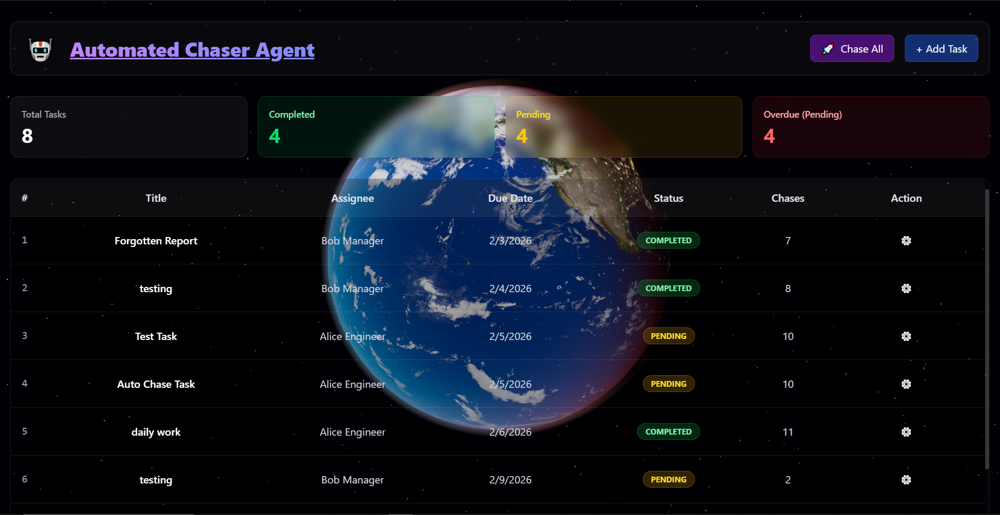

# 🤖 Automated Chaser Agent

> An intelligent task management agent that chases your assignees so you don't have to.

[](https://app.slack.com/client/T0ADJ7EK37X/C0ADMKX6VQA)

 


## ✨ Features

- **🚀 Automated Chasing**: Intelligently sends reminders for overdue tasks using Boltic workflows.
- **🌍 3D Immersive UI**: A stunning, interactive 3D Earth background built with Three.js and React Three Fiber.
- **📱 Fully Responsive**: Seamless experience across desktop, tablet, and mobile devices.
- **⚡ Real-time Updates**: Instant status updates and chase logging.
- **📊 Smart Check**: One-click analysis to identify and chase all overdue tasks simultaneously.
- **🎨 Glassmorphism Design**: Modern, sleek UI with glass-like aesthetics and smooth animations.

## 🛠️ Tech Stack

### Frontend
- **Framework**: [React](https://react.dev/) + [Vite](https://vitejs.dev/)
- **Styling**: [Tailwind CSS v4](https://tailwindcss.com/)
- **3D Graphics**: [Three.js](https://threejs.org/) + [React Three Fiber](https://docs.pmnd.rs/react-three-fiber)
- **Animations**: [GSAP](https://greensock.com/gsap)

### Backend
- **Runtime**: [Node.js](https://nodejs.org/)
- **Framework**: [Express.js](https://expressjs.com/)
- **Database**: [SQLite](https://www.sqlite.org/index.html)
- **Integration**: Boltic (Webhook workflows)

---

## 🚀 Getting Started

Follow these instructions to get the project up and running on your local machine.

### Prerequisites

- [Node.js](https://nodejs.org/) (v16 or higher)
- [npm](https://www.npmjs.com/) (usually comes with Node.js)

### 📥 Installation

1. **Clone the repository**
   ```bash
   git clone https://github.com/abhay333d/Hacktimus.git
   cd Hacktimus/chaser-agent
   ```

2. **Install Backend Dependencies**
   ```bash
   cd server
   npm install
   ```

3. **Install Frontend Dependencies**
   ```bash
   cd ../client
   npm install
   ```

---

## 🏃‍♂️ Running the Application

You need to run both the backend server and the frontend client concurrently. Open two terminal windows/tabs.

### 1. Start the Backend Server
In the first terminal:
```bash
cd server
node server.js
```
*The server will start on `http://localhost:3001` and connect to the SQLite database.*

### 2. Start the Frontend Client
In the second terminal:
```bash
cd client
npm run dev
```
*The client will start (usually on `http://localhost:5173`). Open this URL in your browser to use the app.*

---

## 📁 Project Structure

```
chaser-agent/
├── client/                 # Frontend (React + Vite)
│   ├── src/
│   │   ├── components/     # UI Components (TaskTable, Modals, 3D Background)
│   │   ├── services/       # API Integration
│   │   └── App.tsx         # Main Component
│   └── package.json
│
├── server/                 # Backend (Express + SQLite)
│   ├── chaser.db           # SQLite Database File
│   ├── server.js           # Main Server File
│   ├── db.js               # Database Connection & Schema
│   └── package.json
│
└── README.md
```